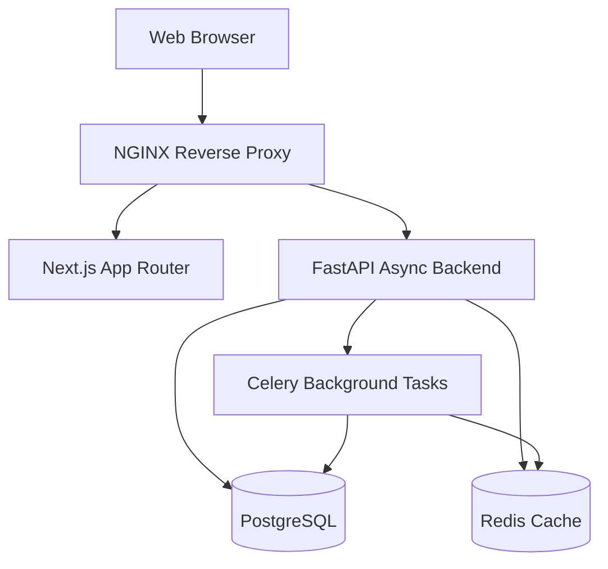

# Implementation Plan: Academic Management System

This project aims to convert a GUI system application into a modern web-based Academic Management System. The new system will provide dynamic form-based web UI replacing Excel workflows. Modules include Academic Calendar, Holiday List, and Individual Timetable. 

The tech stack comprises Next.js (Frontend), FastAPI (Backend), PostgreSQL (Database), and Redis/Celery (Caching & Workers) coordinated via Docker Compose.

## 1. System Architecture



## 2. Database Schema Design

Structured using SQLModel & SQLAlchemy:

- `users`: id, email, password_hash, role
- `academic_calendar`: id, semester, academic_year, start_date, end_date, total_weeks, working_days
- `holidays`: id, holiday_name, holiday_date, type (National/Festival/Institution)
- `subjects`: id, name, code
- `faculty`: id, name, department
- `timetable`: id, faculty_id, subject_id, class_name, day_of_week, period_number, room

## 3. Directory Structure

```text
d:/1.Projects/Lesson Plan/Lesson Plan 3/
├── frontend/
│   ├── app/ (Next.js App Router)
│   ├── components/ (ShadCN, Forms, UI)
│   ├── lib/ (utils, api clients)
│   ├── package.json
│   └── public/
├── backend/
│   ├── main.py (FastAPI entry)
│   ├── api/ (routers: auth, calendar, holidays, timetable)
│   ├── core/ (config, security)
│   ├── db/ (SQLModel setup, models)
│   ├── tasks/ (Celery worker)
│   ├── requirements.txt
│   └── Dockerfile
├── docker/
│   ├── nginx.conf
│   └── init_db.sql
└── docker-compose.yml
```

## 4. Proposed Changes

### Backend Component
- **[NEW] `backend/main.py`**: FastAPI initialization, CORS, Redis config.
- **[NEW] `backend/db/models.py`**: SQLModel schemas for Users, Calendar, Holidays, Timetable.
- **[NEW] `backend/api/auth.py`**: JWT login.
- **[NEW] `backend/api/calendar.py`**: Calendar CRUD and auto working-day logic.
- **[NEW] `backend/api/holidays.py`**: Dynamic bulk insert & duplicate check.
- **[NEW] `backend/api/timetable.py`**: Clash detection logic before insert.
- **[NEW] `backend/tasks/worker.py`**: Celery worker for heavy calculations (if needed).

### Frontend Component
- **[NEW] `frontend/package.json`**: Dependencies (Next.js, Tailwind, ShadCN, Zod, React Hook Form).
- **[NEW] `frontend/app/layout.tsx`**: Base layout, Providers, Dark mode check.
- **[NEW] `frontend/app/dashboard/page.tsx`**: Summary cards and navigation.
- **[NEW] `frontend/app/(modules)/calendar/page.tsx`**: Calendar module with Forms.
- **[NEW] `frontend/app/(modules)/holidays/page.tsx`**: Dynamic repeatable rows pattern.
- **[NEW] `frontend/app/(modules)/timetable/page.tsx`**: Grid layout for clash detection.

### Infrastructure
- **[NEW] `docker-compose.yml`**: PostgreSQL, Redis, FastAPI, Next.js, Celery, NGINX definitions.
- **[NEW] `backend/Dockerfile`** & **[NEW] `frontend/Dockerfile`**.
- **[NEW] `docker/nginx.conf`**: Route `/api` to backend, `/` to frontend.

## 5. Verification Plan

### Automated Tests
- Run `pytest` within the Backend docker container to test clash detection logic, background tasks, and working days calculations.
  *(Command: `docker-compose exec backend pytest`)*

### Manual Verification
- `docker-compose up --build -d` to launch the full system locally.
- Validate the UI locally on port `80` (or Next.js port).
- Submit forms in each of the 3 modules and check PostgreSQL logic and FastAPI validation (using Zod on the frontend and Pydantic on the backend). 
- Insert a conflicting timetable entry to verify clash detection triggers a 400 error.
